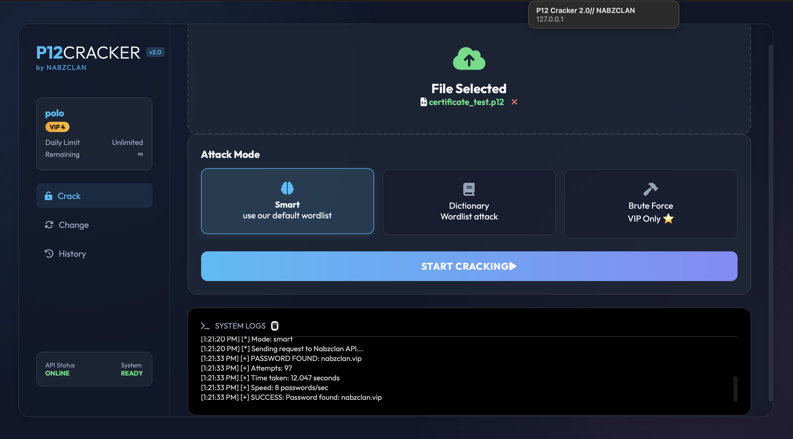
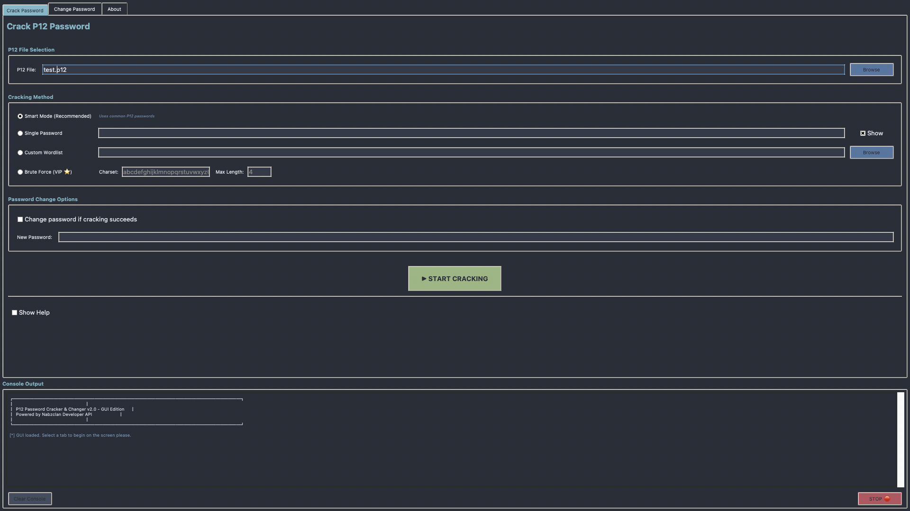

# P12 Password Cracker & Changer

A powerful tool for cracking, verifying, and changing passwords for P12/PKCS#12 certificate files using the Nabzclan Developer API.


## Features

- **P12 Password Recovery**:
  - **Smart Mode**: Automatically tries common P12 password patterns (Recommended)
  - **Dictionary Attack**: Supports custom wordlists via local file, URL, or command-line array
  - **Brute Force**: Comprehensive character-set attack with length options (VIP Only)
  - **Single Verification**: Quickly check a specific password
- **P12 Password Changer**: Securely change the password of a P12 file directly
- **Direct File Upload**: Files are processed securely via memory-efficient streamed uploads to the API
- **Plan Integration**: Automatic checks for plan limits and capabilities (Free vs VIP)

## Installation

```bash
# Clone repository
git clone https://github.com/nabzclan-reborn/p12-password-cracker.git
cd p12-password-cracker

# Install required dependencies
pip3 install -r requirements.txt
```

## Configuration

Before using the tool, you must configure your API key:
1. Rename `.env.example` to `.env`
2. Open `.env` and replace `YOUR_API_KEY_HERE` with your actual API key
3. You can get your key at: https://developer.nabzclan.vip/dashboard/tokens

## Usage Examples

### CLI (Command Line Interface)

```bash
# Check your API plan and usage
python3 main.py status

# Smart Mode (Recommended default)
python3 main.py crack -p certificate.p12 --smart

# Single Password Verification
python3 main.py crack -p certificate.p12 -s "password123"

# Dictionary Attack (Local File)
python3 main.py crack -p certificate.p12 -l wordlist.txt

# Dictionary Attack (Inline Array)
python3 main.py crack -p certificate.p12 -a password123 admin root

# Brute Force Attack (VIP Only)
# Default: a-z0-9, max-length 4
python3 main.py crack -p certificate.p12 -b
# Custom: 0-9 charset, max-length 6
python3 main.py crack -p certificate.p12 -b --charset 0123456789 --max-length 6

# Change Password
python3 main.py change -p certificate.p12 -o "oldpass" -n "newpass"
```

### Web UI (Recommended)

WEB UI version in flask is in progressbut still working sorry i had to rush it and work on something else next update it should be done

```bash
# Run the web application
python3 app.py
```
Open your browser to `http://127.0.0.1:5000`



### GUI (Legacy Application)

For the classic desktop window experience:

```bash
python3 run_gui.py
```



## Changelog

### v2.0 - 9 days working on it - today 8 hours - [Release Thread](https://nabzclan.vip/threads/p12cracker-v2-0-script-github-01-04-2026-update.159/)
- Migrated to Nabzclan Developer API for higher performance and reliability
- Added Brute Force mode (VIP) with custom charset and length options
- Added Smart Mode for intelligent password guessing
- Added Password Array mode for inline dictionary attacks
- Added Status command to check API plan and usage
- Implemented direct file uploads (removed complex URL/CDN logic)
- Enhanced GUI with new modes, resizable window, and live user status
- Improved error handling with detailed API feedback and limit warnings

### v1.4
- Removed default wordlist feature
- Eliminated direct P12 download link requirement


- Rewrote features for improved performance

### v1.3
- Added P12 Password Changing support
- Expanded default wordlist
- Added simple mode
- Improved error handling

### v1.2
- Performance improvements
- UI enhancements

### v1.1
- Initial public release

## API Documentation

This tool is powered by the Nabzclan Developer API.
----
Documentation: https://developer.nabzclan.vip/docs/endpoints/p12-cracker

## License

This project is licensed under the MIT License - see the LICENSE file for details.
